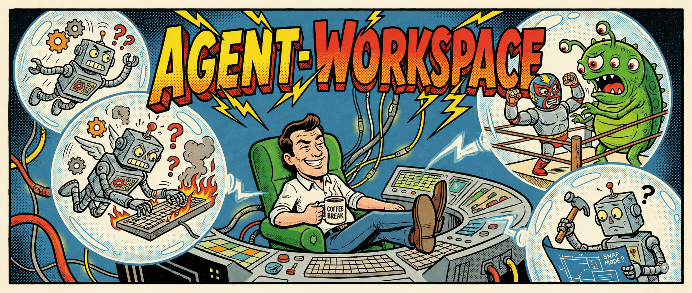

# agent-workspace

[](https://www.npmjs.com/package/agent-workspace)

A Git worktree workflow tool for AI coding agents. Enables parallel development with isolated environments.



## Why

AI coding agents work best with isolated environments:

- **Parallel execution**: Run multiple agents simultaneously without interference
- **Clean separation**: Each feature gets its own working directory
- **Snap mode**: "Use and discard" workflow — create worktree, run agent, merge, cleanup

### Fork notes

This is a fork of [`nekocode/agent-worktree`](https://github.com/nekocode/agent-worktree). Highlights of the fork:

- **Native [Jujutsu (`jj`)](https://jj-vcs.github.io/jj/) backend** alongside git. Both backends are feature-complete for `wt`'s happy-path workflows (new / ls / cd / rm / clean / merge / sync / status / mv). Lives behind `src/vcs/` with `GitBackend` and `JjBackend` as separate impls of a common trait. Colocated repos (both `.git/` and `.jj/` present) default to jj — override with `--vcs=git` or `[general] vcs = "git"` in `.agent-workspace.toml`. A few git-shaped operations have no clean jj analogue and surface `Error::Unsupported` with a hint: `wt mv` (use `wt rm` + `wt new` instead) and `wt sync --abort`/`--continue` (jj records conflicts in commits — resolve files and re-run). See [`AGENTS.md`](AGENTS.md) → "VCS backend compatibility" for the full semantic-delta table.
- **Terminal-tab integration** for `wt new` on Windows Terminal, iTerm2, and GNOME Terminal — the creation flow opens a new tab titled with the branch and runs there; the originating shell stays put. Auto-enabled when supported; disable with `--no-tab` or `[ui] open_in_new_tab = false`.
- **Copy-on-Write worktree creation** on filesystems that support block cloning (Windows ReFS / DevDrive, Linux Btrfs / XFS, macOS APFS). `wt new` becomes near-instant on large monorepos and the new worktree initially occupies only its diff on disk. Auto-enabled when the source repo and `$AGENT_WORKSPACE_DIR` are on the same reflink-capable volume; falls back silently to `git worktree add` otherwise. Disable with `--no-cow` or `[create] use_cow = false`.

## Install

### Quick install (no Node.js required)

**macOS / Linux:**

```bash
curl -fsSL https://github.com/ZelAnton/agent-workspace/releases/latest/download/install.sh | sh
```

**Windows (PowerShell):**

```powershell
iwr https://github.com/ZelAnton/agent-workspace/releases/latest/download/install.ps1 -UseBasicParsing | iex
```

Installs `wt` to `~/.agent-workspace/bin`, adds it to your PATH, and runs `wt setup` for shell integration.

### Via npm

```bash
npm install -g agent-workspace
```

### Update

```bash
wt update
```

`wt update` detects how `wt` was installed (`~/.agent-workspace/install_channel`):
- **Shell installer** — downloads the latest release from GitHub and atomically replaces itself (uses [`self_replace`](https://crates.io/crates/self-replace) for the Windows .exe rename-trick).
- **npm** — re-runs `npm install -g agent-workspace@latest`.

Shell integration is installed automatically by both channels. To reinstall manually:

```bash
wt setup
```

Supported shells: bash, zsh, fish, PowerShell

## Quick Start

```bash
# Create a worktree and enter it
wt new feature-x

# ... develop, commit ...

# Merge back (merges to the branch you were on when creating)
wt merge            # keeps worktree
wt merge -d         # deletes worktree after merge
```

Other useful commands:

```bash
wt ls              # List all worktrees (with BASE branch info)
wt cd feature-y    # Switch to another worktree
wt cd              # Return to main repository
```

## Snap Mode

One-liner for AI agent workflows:

```bash
wt new -s claude           # Random branch name
wt new fix-bug -s codex    # Specified branch name
wt new -s "claude --dangerously-skip-permissions"  # Command with arguments
```

> **Argument quoting** — `-s` takes a single token. Use quotes whenever the
> command has flags or arguments (`-s "agent --flag"`), otherwise the shell
> hands the trailing args to `wt new` instead.
>
> **Nested snap is refused** — running `wt new -s` from inside an existing
> worktree exits with an error. Run `wt cd` to return to the main repo first.

Flow: Create worktree → Enter → Run agent → [Develop] → Agent exits → Check changes → Merge → Cleanup

After the agent exits — whether normally or with a crash / Ctrl+C — `wt`
checks the worktree state:

- **No changes**: Worktree cleaned up automatically
- **Only commits** (nothing uncommitted):
  ```
  [m] Merge into base branch
  [q] Exit snap mode
  ```
- **Uncommitted changes**:
  ```
  [r] Reopen agent (let agent commit)
  [q] Exit snap mode (commit manually)
  ```

> **base_branch must still exist** — if the worktree's base branch was
> deleted while the agent ran, `[m]` errors out. Use `wt merge --into <branch>`
> to pick an explicit target instead.

## Commands

### Worktree Management

| Command | Description |
|---------|-------------|
| `wt new [branch]` | Create worktree from current branch (random name if omitted) |
| `wt new --base <branch>` | Create from specific base branch (default: current branch) |
| `wt new -s <cmd>` | Create + snap mode |
| `wt cd [branch]` | Switch to worktree (omit branch to return to main repo) |
| `wt ls` | List worktrees |
| `wt ls -l` | Show full path for each worktree |
| `wt mv <old> <new>` | Rename worktree (use `.` for current) |
| `wt rm <branch>` | Remove worktree (use `.` for current) |
| `wt rm -f <branch>` | Force remove with uncommitted changes |
| `wt clean` | Remove worktrees with no diff from their base branch (falls back to trunk); dirty worktrees are skipped |
| `wt clean --dry-run` | Preview which worktrees would be cleaned |

### Workflow

| Command | Description |
|---------|-------------|
| `wt merge` | Merge to base branch (falls back to trunk, default: squash) |
| `wt merge -s <strategy>` | Merge with strategy (squash/merge) |
| `wt merge --into <branch>` | Merge to specific branch (overrides base) |
| `wt merge -d` | Delete worktree after merge (default: keep) |
| `wt merge -H` | Skip pre-merge hooks |
| `wt sync` | Sync from base branch (falls back to trunk, default: rebase) |
| `wt sync -s <strategy>` | Sync with strategy (rebase/merge) |
| `wt sync --from <branch>` | Sync from specific branch (overrides base) |
| `wt sync --continue` | Continue after resolving conflicts |
| `wt sync --abort` | Abort sync |

### Info

| Command | Description |
|---------|-------------|
| `wt status` | Show current worktree info (also reports in-progress `wt sync` rebase/merge with recovery hints) |
| `wt update` | Update to the latest version |

### Configuration

| Command | Description |
|---------|-------------|
| `wt setup` | Install shell integration (auto-detect) |
| `wt setup --shell zsh` | Install for specific shell |
| `wt init` | Initialize project config |
| `wt init --trunk <branch>` | Initialize with specific trunk branch |
| `wt init --merge-strategy <strategy>` | Set default merge strategy (squash/merge) |
| `wt init --sync-strategy <strategy>` | Set default sync strategy (rebase/merge) |
| `wt init --copy-files <pattern>` | Files to copy to new worktrees (repeatable) |

## Configuration

### Base Directory

Defaults to `~/.agent-workspace`. Override via `AGENT_WORKSPACE_DIR`:

```bash
export AGENT_WORKSPACE_DIR=/data/agent-workspace
```

### Global Config `$AGENT_WORKSPACE_DIR/config.toml` (default `~/.agent-workspace/config.toml`)

```toml
[general]
merge_strategy = "squash"  # squash | merge
sync_strategy = "rebase"   # rebase | merge
copy_files = [".env", ".env.*"]  # Gitignore-style patterns for files to copy

[hooks]
post_create = ["pnpm install"]
pre_merge = ["pnpm test", "pnpm lint"]
post_merge = []
```

> **`copy_files` constraints** — patterns are gitignore-style and must stay
> inside the repo: leading `/` (absolute paths) and `..` traversal are
> rejected. Symlinks are not followed.
>
> **Hook trust boundary** — hooks run via `sh -c` (or `cmd /C` on Windows)
> with no sandboxing or timeout. Treat `.agent-workspace.toml` like any
> committed shell script: only run repos whose hooks you would `bash` directly.
>
> **Hook CWD** — `pre_merge` and `post_merge` always run with the worktree
> root as the working directory. `post_create` runs in the new worktree.

### Project Config `.agent-workspace.toml`

Project config overrides global. `trunk` is project-only; other fields are merged.

```toml
[general]
trunk = "main"  # Trunk branch (auto-detected if omitted)
merge_strategy = "merge"  # Override global merge strategy
sync_strategy = "merge"   # Override global sync strategy
copy_files = ["*.secret.*"]  # Appended to global copy_files

[hooks]
post_create = ["pnpm install"]  # Replaces global hooks if set
```

## Storage Layout

```
~/.agent-workspace/
├── config.toml                    # Global config
└── workspaces/
    └── {project}/
        ├── {branch_name}.toml     # Worktree metadata
        ├── {branch_name}/         # Worktree directory
        └── ...
```

## License

MIT
